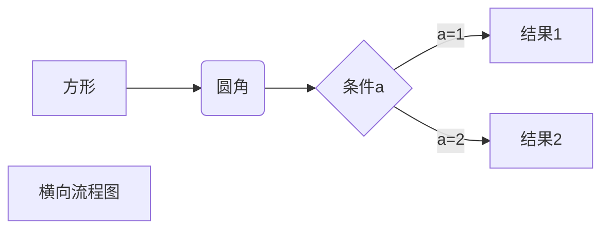
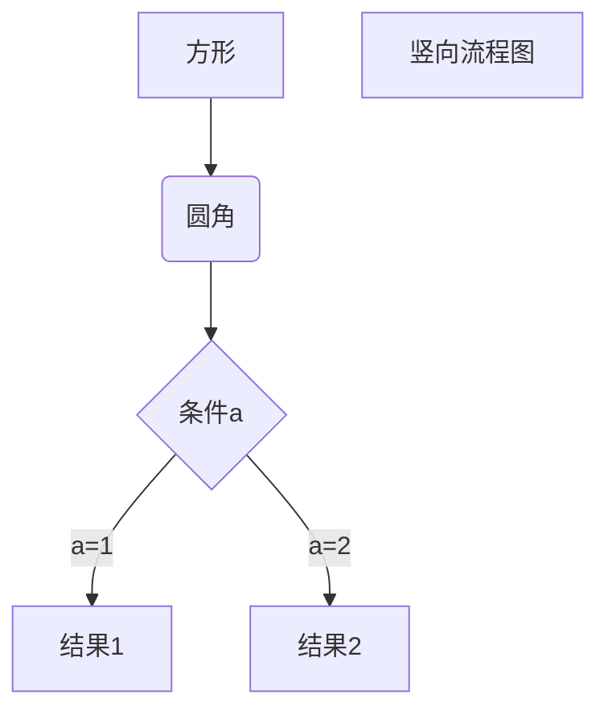
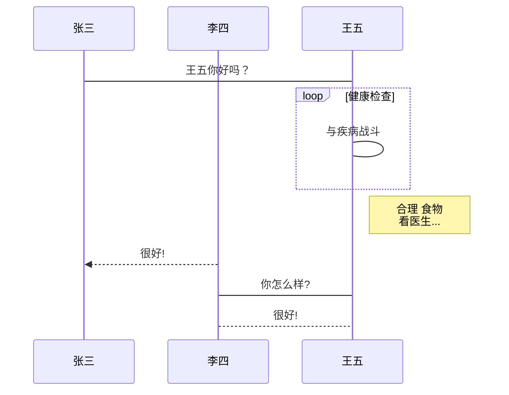
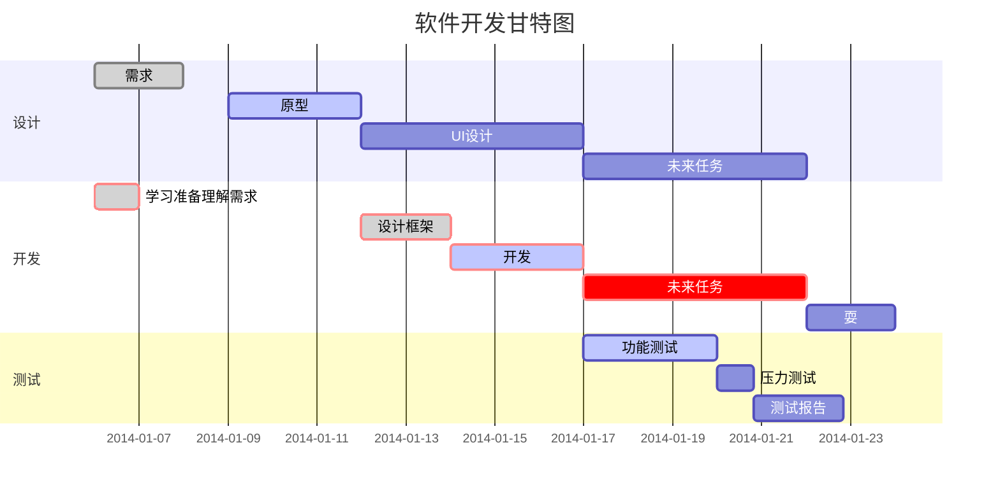

本文档由 Bilibili@二一的笔记 撰写

欢迎关注我的频道，有全网最深度的笔记软件与效率工具测评视频

https://space.bilibili.com/319417

如果我的内容能够帮到你，欢迎向更多人推荐我的频道，我想让我的内容被更多的人看到

**这将是激励我保持深度创作的最大动力**

谢谢你！

------

 

 

# 一级标题

## 二级标题

### 三级标题

#### 四级标题

##### 五级标题

###### 六级标题

```
井号加空格，可以生成标题格式；几个井号就是几级标题

# 一级标题
## 二级标题
### 三级标题
```

### 常见问题

如果你发现你的 Markdown 无法正常使用，有可能是因为以下几个原因

1. 没有在英文输入法下使用符号
2. 部分笔记软件并不支持所有的 Markdown 语法，例如 Notion 不支持 `==高亮==`  语法
3. 部分编辑器需要进入`设置` 中开启特定的 Markdown 语法，例如 Typora 就需要手动开启 高亮 功能

 

### 列表

#### 有序列表

```
英文输入法下，数字后面加一点，然后空格
```

1. AAA  `1. AAA`
2. BBB  `2. BBB`
3. CCC  `3. CCC`

#### 无序列表

```
1. 有三种语法符号，三种都可以
2. 但更推荐使用短横杠，因为不需要使用组合键
```

- AAA `- AAA`

- BBB `+ BBB`

- CCC `* CCC`

#### 列表的互相嵌套

**基础语法：**

1. 一个回车可以使列表递进，两个回车可以取消自动列表
2. 使用 tab 可以使列表缩进，使用 shift +tab 可以取消列表缩进

**有序和无序列表的互相嵌套：**

1. 按 回车 生成列表第二项
2. 按 tab 缩进列表
3. 再按 回车 取消列表第二项
4. 然后使用有序或者无序列表的基础语法即可

------

 

### 字体标记

```
所有符号都需要在英文输入法下
```

1. **加粗**  `**加粗**`
2. ~~删除~~  `~~删除~~`
3. *斜体*  `*斜体*`
4. 高亮  `==高亮==`  

**注：**部分笔记软件对 Markdown 的支持不够完全，可能只支持 `加粗`

------

 

### 段落相关

1. 引用语法

```
> 这是一段引用
```

> 这是一段引用

1. 分割线

```
--- ; 三个或以上的短横杠，然后回车
```

------

 

### 代码

#### 行内代码

```
`行内代码`  ；这个符号的位置在数字键 1 左边的那个小点上，注意需要在英文输入法下使用
```

可以在一句话中的任意位置使用 `行内代码` 语法

#### 代码块

**基础语法：**

````
```
1. 在英文输入法下，输入三个小点 `
2. 部分笔记软件可以直接回车
3. 其他笔记软件则需要手动在末尾补上三个小点
```
$(document).ready(function () {
    alert('eryi');
});
from settings import world
if world == 'mine':
   kept =  keep(world)
let myWorld = "Hello World"
print(myWorld)
````

 

### 超链接

#### 基础链接用法

```
[百度](www.baidu.com)
```

​	**示例：**[百度](www.baidu.com)

#### 高级链接用法

**两种使用场景：**

- ① 在文稿起草阶段，还没确定具体网址，但可以先给出网址标题
- ② 同一篇文章需要重复出现同一个网址时

**使用方法：**

```
1. 格式 ：[网址标题][变量01]
2. 在文档最后解释变量

[变量01]:www.baidu.com
```

**示例：**

- [我的博客](http://eryinote.com)
- 

------

 

### 脚注

**语法：**

```
这是一句需要添加脚注的话[^01]

[^01]:这是放在文档最底下，用来解释脚注的内容
```

**示例：**

1. 这是一句需要添加脚注的话[1](#dfref-footnote-1)
2. 这是另一句话[2](#dfref-footnote-2)

------

 

### 图片

#### 基础语法

```
1. 基本格式：
2. 示例：
3. 图片链接可以是本地链接，也可以是在线链接
```

#### 图床

##### 什么是图床

所谓的图床就是用来**在线存放图片的地方**，可以理解为专门用来存放图片的网盘。图床上的每一张图片都能够生成一个唯一的访问链接，使用这个链接，任何人都能够在线读取你的图片。

##### 为什么你可能会需要图床

- 因为 Markdown 编辑器的文档无法内嵌图片，所有图片都以 ``的形式写在 Markdown 文档内，如果这里的「图片链接」使用的是本地图片的链接，那么当你分享这一个 Markdown 文档、或者你自己在别的地方打开这个 Markdown 文档时，文档里的图片就无法正常显示了。
- 所以需要将图片上传到图床，生成一个可以在线访问的图片链接后，在任意地方分享、打开这个 Markdown 文件，所有的图片就都能正常显示

##### 如何搭建图床

由于本文的主旨仍是 Markdown 的语法教学，所以就不在此处介绍过多的图床搭建教程，但你可以在我的 [个人博客](https://eryinote.com) 阅读这篇 [图床搭建教程](https://eryinote.com/post/105) ，整个过程非常简单，无需任何代码基础，只是需要一点点小小的耐心。

------

 

### 表格

**基础语法：**

```
|  表头   | 表头  |
|  ----  | ----  |
| 单元格  | 单元格 |
| 单元格  | 单元格 |
```

**表格对齐：**

1. 左对齐：`:----`
2. 居中对齐： `:----:`
3. 右对齐：`----:`

```
| 左对齐 | 居中对齐 | 右对齐 |
| :----|:----:|----:|
| AAA | BBB | CCC |
```

| 左对齐 | 居中对齐 | 右对齐 |
| :----- | :------: | -----: |
| AAA    |   BBB    |    CCC |

------

|      |      |      |
| ---- | ---- | ---- |
|      |      |      |
|      |      |      |
|      |      |      |

 

### 图表

**注意：** 

1. **不是所有的 Markdown 编辑器都支持图表语法**
2. 由于要完全学会这些语法，起码要厚厚一本书的教程长度，所以本文仅做展示
3. 并且其实我并不推荐用 Markdown 语法去画图表，你有更好的工具去实现这类需求，没必要舍近求远
4. 如果你实在感兴趣的话，可以访问学习 Github 的这个开源项目 →  [Mermaid 语法](https://github.com/mermaid-js/mermaid)

#### ①

````

````

 

a=1a=2方形圆角条件a结果1结果2横向流程图

#### ②

````

````

a=1a=2方形圆角条件a结果1结果2竖向流程图

#### ③

````
```sequence
对象A->对象B: 对象B你好吗?（请求）
Note right of 对象B: 对象B的描述
Note left of 对象A: 对象A的描述(提示)
对象B-->对象A: 我很好(响应)
对象A->对象B: 你真的好吗？
```
````

对象A对象A对象B对象B对象B你好吗?（请求）对象B的描述对象A的描述(提示)我很好(响应)你真的好吗？

#### ④

````

````

张三李四王五loop[健康检查]合理 食物看医生...王五你好吗？与疾病战斗很好!你怎么样?很好!张三李四王五

#### ⑤

````

````

2014-01-072014-01-092014-01-112014-01-132014-01-152014-01-172014-01-192014-01-212014-01-23需求学习准备理解需求原型UI设计设计框架开发未来任务未来任务功能测试压力测试测试报告耍设计开发测试软件开发甘特图

------

1 这是解释脚注 01的内容 [↩](#ref-footnote-1)

2 测试 [↩](#ref-footnote-2)